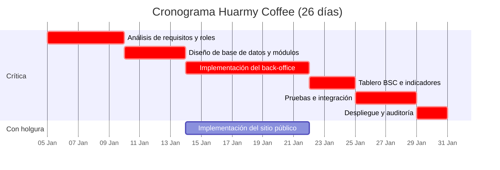
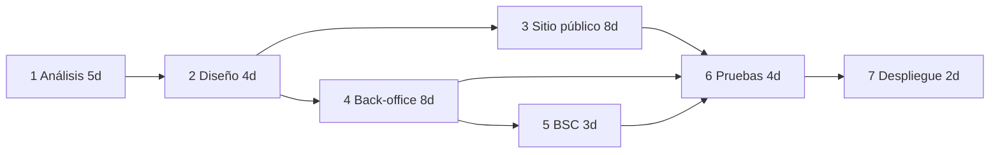

# Informe técnico — Huarmy Coffee

**Sistema de gestión web para cafetería y restaurante**  
**Fecha de actualización.** 26 de agosto de 2026.

Este expediente reúne lo que el proyecto debe demostrar académicamente y el estado **real** de la aplicación (sitio público + panel `/admin` + API Express/PostgreSQL). Las pantallas que se retiraron de la interfaz quedan documentadas aquí; lo operativo se describe tal como está hoy.

**Contenido**

1. [Puntos de función (IFPUG)](#1-puntos-de-función-ifpug)  
2. [Diagrama de Gantt](#2-diagrama-de-gantt)  
3. [Red crítica y días de holgura](#3-red-crítica-y-días-de-holgura)  
4. [Definición de roles y accesos](#4-definición-de-roles-y-accesos)  
5. [Reporte del superadmin (bitácora del portal)](#5-reporte-del-superadmin-bitácora-del-portal)  
6. [Dashboard](#6-dashboard)  
7. [Indicadores y estándares](#7-indicadores-y-estándares)  
8. [Tablero de comando BSC → Procesos](#8-tablero-de-comando-bsc--procesos)  
9. [Identidad individual y modularidad](#9-identidad-individual-y-modularidad)  
10. [Estado actual de la aplicación](#10-estado-actual-de-la-aplicación)  
11. [Elementos retirados de la interfaz](#11-elementos-retirados-de-la-interfaz)

---

## 1. Puntos de función (IFPUG)

Estimación del **tamaño funcional** del sistema Huarmy Coffee. No se publica como pantalla del admin; se usa para el informe de software.

**Método.** Puntos de función no ajustados (UFP) y ajustados (AFP).  
**Factores GSC.** 14 factores con valor medio 3.  
**Fórmula.** VAF = 0,65 + 0,01 × ΣGSC = 0,65 + 0,01 × 42 = **1,07**  
**Resultado actualizado.** UFP = **150** · AFP = **160,5**

El catálogo incluye el módulo de **pedidos y caja** incorporado para recepción.

### 1.1 Pesos por tipo y complejidad

| Tipo | Baja | Media | Alta |
|---|---|---|---|
| ILF (archivo lógico interno) | 7 | 10 | 15 |
| EIF (archivo de interfaz externa) | 5 | 7 | 10 |
| EI (entrada externa) | 3 | 4 | 6 |
| EO (salida externa) | 4 | 5 | 7 |
| EQ (consulta externa) | 3 | 4 | 6 |

### 1.2 Catálogo funcional

| Tipo | Función | Complejidad | DET (aprox.) | Puntos | Descripción |
|---|---|---|---|---|---|
| ILF | Clientes | Media | 5 | 10 | Archivo lógico de clientes |
| ILF | Usuarios y roles | Media | 7 | 10 | Cuentas internas, rol y sucursal |
| ILF | Sucursales y capacidad | Baja | 6 | 7 | Sedes y aforo |
| ILF | Servicios y categorías | Media | 8 | 10 | Catálogo de menú |
| ILF | Citas | Media | 6 | 10 | Reservas y estados |
| ILF | Pedidos y caja | Media | 8 | 10 | Pedido, detalle, cobro y método de pago |
| ILF | Inventarios | Media | 6 | 10 | Stock por sucursal (alerta ≤ 3) |
| ILF | Indicadores BSC | Baja | 6 | 7 | Valor, meta, estándar y perspectiva |
| ILF | Plan del proyecto | Media | 6 | 10 | Tareas, predecesoras y CPM |
| ILF | Bitácora | Baja | 7 | 7 | Auditoría de acciones del portal |
| ILF | Contenido público | Alta | 12 | 15 | Galería, promociones, misión, configuración |
| EIF | Firebase Auth (opcional) | Baja | 3 | 5 | Identidad externa opcional |
| EI | Login / reset de contraseña | Media | 4 | 4 | Entradas de autenticación |
| EI | CRUD autenticado | Alta | 20 | 6 | Altas y cambios de entidades de negocio |
| EI | Reserva pública | Media | 8 | 4 | Entrada del sitio (cita) |
| EO | Dashboard y tablero BSC | Media | 10 | 5 | Conteos, gráficos y perspectivas |
| EO | Informe de bitácora | Media | 7 | 5 | Salida de auditoría para el superadmin |
| EO | Red crítica / Gantt | Media | 8 | 5 | Salida de CPM y holguras |
| EQ | Consultas públicas | Media | 8 | 4 | Menú, sucursales, galería |
| EQ | Consultas internas | Alta | 16 | 6 | Listados GET del back-office |

### 1.3 Totales por tipo

| Tipo | Puntos |
|---|---|
| ILF | 106 |
| EIF | 5 |
| EI | 14 |
| EO | 15 |
| EQ | 10 |
| **UFP** | **150** |
| **AFP (× 1,07)** | **160,5** |

---

## 2. Diagrama de Gantt

El cronograma **no se edita en el admin**. Representa el plan de desarrollo del sistema (duración **26 días**). Las barras marcadas como críticas no admiten demora.

Lectura en días de proyecto (día 0 = inicio):

| Tarea | Inicio más temprano | Fin más temprano | Duración |
|---|---|---|---|
| 1 Análisis de requisitos y roles | 0 | 5 | 5 |
| 2 Diseño de BD y módulos | 5 | 9 | 4 |
| 3 Sitio público | 9 | 17 | 8 |
| 4 Back-office | 9 | 17 | 8 |
| 5 Tablero BSC | 17 | 20 | 3 |
| 6 Pruebas e integración | 20 | 24 | 4 |
| 7 Despliegue y auditoría | 24 | 26 | 2 |

Las tareas 3 y 4 arrancan en paralelo después del diseño (día 9). El Gantt muestra que el sitio público termina el día 17, pero las pruebas no pueden empezar hasta el día 20 (cuando cierra el BSC); por eso la barra 3 tiene holgura.

---

## 3. Red crítica y días de holgura

**Método.** CPM (Critical Path Method).  
**Duración del proyecto.** **26 días**.  
**Holgura.** LS − ES. Si es **0**, la tarea es crítica.

**Ruta crítica** (holgura = 0):

Análisis de requisitos y roles → Diseño de base de datos y módulos → Implementación del back-office → Tablero BSC e indicadores → Pruebas e integración → Despliegue y auditoría.

### 3.1 EDT / predecesoras

| Id | Tarea | Duración (días) | Predecesoras | Responsable |
|---|---|---|---|---|
| 1 | Análisis de requisitos y roles | 5 | — | Equipo |
| 2 | Diseño de base de datos y módulos | 4 | 1 | Administrador |
| 3 | Implementación del sitio público | 8 | 2 | Equipo |
| 4 | Implementación del back-office | 8 | 2 | Administrador |
| 5 | Tablero BSC e indicadores | 3 | 4 | Gerencia |
| 6 | Pruebas e integración | 4 | 3, 4, 5 | Equipo |
| 7 | Despliegue y auditoría | 2 | 6 | Administrador |

### 3.2 Cálculo ES / EF / LS / LF / holgura

| Id | Tarea | ES | EF | LS | LF | Holgura | Crítica |
|---|---|---|---|---|---|---|---|
| 1 | Análisis de requisitos y roles | 0 | 5 | 0 | 5 | **0** | Sí |
| 2 | Diseño de BD y módulos | 5 | 9 | 5 | 9 | **0** | Sí |
| 3 | Sitio público | 9 | 17 | 12 | 20 | **3** | No |
| 4 | Back-office | 9 | 17 | 9 | 17 | **0** | Sí |
| 5 | Tablero BSC e indicadores | 17 | 20 | 17 | 20 | **0** | Sí |
| 6 | Pruebas e integración | 20 | 24 | 20 | 24 | **0** | Sí |
| 7 | Despliegue y auditoría | 24 | 26 | 24 | 26 | **0** | Sí |

- **ES / EF:** inicio y fin más tempranos.  
- **LS / LF:** inicio y fin más tardíos **sin retrasar** el proyecto (día 26).  
- La única tarea con holgura es la **implementación del sitio público (3 días)**: puede retrasarse hasta el día 12 sin mover la fecha de entrega. Cualquier demora en la ruta 1-2-4-5-6-7 **atrasa el proyecto**.

---

## 4. Definición de roles y accesos

El sistema usa **RBAC** (`usuarios.rol`) y, cuando corresponde, **sucursal** (`usuarios.sucursal_id`). Autenticación: **bcrypt + JWT**. El menú del admin **solo muestra** lo autorizado; la API aplica el mismo criterio.

### 4.1 Identidad de cada rol

| Rol | Identidad | Qué hace |
|---|---|---|
| `admin` (superadmin) | Administrador | Acceso total. Gestiona usuarios. Es el único que **consulta el reporte de bitácora** (qué hicieron los demás en el portal). |
| `gerente` | Gerencia | Operación, BSC, catálogo, sedes, proveedores, socios y comunicación. **No** crea ni edita cuentas. |
| `recepcionista` | Front-office de sede | Recibe al cliente, citas, **pedidos y caja**, menú, inventarios y capacidad. Si tiene `sucursal_id`, ve citas/pedidos/inventario de su sede. |
| `cajero` | Mostrador / cobro | Clientes, citas, **pedidos y cobros**. |

Cuentas de prueba: `admin@huarmycoffee.com` / `admin123` · `recepcionista@huarmycoffee.com` / `recepcionista123`.

### 4.2 Matriz de acceso (módulos visibles)

| Módulo | Ruta | admin | gerente | recepcionista | cajero |
|---|---|---|---|---|---|
| Dashboard | `/admin` | ● | ● | ● | ● |
| Tablero BSC | `/admin/scorecard` | ● | ● | — | — |
| Menú (pestañas) | `/admin/menu` | ● | ● | ● | — |
| Citas | `/admin/citas` | ● | ● | ● | ● |
| Pedidos y caja | `/admin/pedidos` | ● | ● | ● | ● |
| Clientes | `/admin/clientes` | ● | ● | ● | ● |
| Inventarios | `/admin/inventarios` | ● | ● | ● | — |
| Capacidad | `/admin/capacidad` | ● | ● | ● | — |
| Sucursales | `/admin/sucursales` | ● | ● | — | — |
| Proveedores | `/admin/proveedores` | ● | ● | — | — |
| Socios | `/admin/socios` | ● | ● | — | — |
| Comunicación | `/admin/comunicacion` | ● | ● | — | — |
| Usuarios | `/admin/usuarios` | ● | — | — | — |
| **Bitácora / reporte de acciones** | expediente + API `/api/auditoria` | ● | — | — | — |

La pantalla de matriz «Roles y módulos» **no está en el menú**. El control real está en `roleAccess` (front) y `server/roles.js` (API).

---

## 5. Reporte del superadmin (bitácora del portal)

Al final de la cadena de roles, el **superadmin (`admin`)** es quien reconstruye **qué hicieron los demás** en el portal. Esa vista **no es un ítem del sidebar** (se retiró con Bitácora); el reporte vive en este expediente y en el API interno `GET /api/auditoria` (solo `admin`).

**Objetivo.** Evidencia de login, altas, ediciones, eliminaciones, cobros y reservas públicas.

**Registro por evento** (`auditoria`)

| Dato | Descripción |
|---|---|
| Fecha y hora | Momento de la acción |
| Usuario y rol | Quién ejecutó (o `publico` si viene del sitio) |
| Acción | `login`, `crear`, `editar`, `eliminar` |
| Módulo | Entidad (`clientes`, `citas`, `pedidos`, `usuarios`, etc.) |
| Detalle | Identificador o nota breve |
| Ruta | Endpoint llamado |

**Resumen gerencial.** Consolidado por persona: total de eventos y conteo por tipo de acción.

**Quién lee.** Solo `admin`. Gerente, recepcionista y cajero **no** consultan este reporte.

Ejemplos de hechos que quedan en bitácora: inicio de sesión, registro de cliente, creación de cita, **pedido y cobro**, cambio de usuario, reserva desde el sitio público.

---

## 6. Dashboard

Pantalla inicial del admin (`/admin`). Acceso: **todos los roles internos**.

**Qué muestra**

- Saludo al usuario autenticado y acceso al tablero de comando BSC.  
- **Alerta de inventario:** ítems con cantidad **3 o menos** (Stock Bajo). De 4 en adelante el estado en inventario es verde (OK).  
- Tarjetas de conteo (según rol): clientes, citas, pedidos, proveedores, socios, sucursales, usuarios (solo admin), inventario, comunicaciones.  
- Gráfico **indicadores vs metas**.  
- Mini tablero BSC con promedio de cumplimiento por perspectiva (Financiera, Cliente, **Procesos**, Aprendizaje). La perspectiva de procesos va resaltada.

El dashboard **no sustituye** el tablero BSC: es el resumen operativo; el detalle de indicadores y estándares está en `/admin/scorecard`.

---

## 7. Indicadores y estándares

Cada indicador BSC (`indicadores`) tiene:

| Campo | Significado |
|---|---|
| Nombre | Identidad del indicador |
| Perspectiva | `financiera` · `cliente` · `procesos` · `aprendizaje` |
| Valor actual | Medición vigente |
| **Estándar** | Mínimo aceptable. Si el actual es ≥ estándar, el indicador está en zona aceptable |
| **Meta** | Objetivo gerencial |
| Unidad | `%` u otra |

**Regla de tablero.** Cumplimiento = actual / meta.  
- ≥ 80 % → en estándar de tablero (verde).  
- 50–79 % → advertencia.  
- &lt; 50 % → fuera de estándar.

El estándar y la meta **no son lo mismo**: el estándar es el piso; la meta es el techo que busca gerencia.

---

## 8. Tablero de comando BSC → Procesos

Ruta: `/admin/scorecard`. Roles: **admin** y **gerente**.

Es el **tablero de comando** del Balanced Scorecard, con las cuatro perspectivas de Kaplan y Norton. En este proyecto la perspectiva de **Procesos** es la de operación cotidiana:

**Flujo de procesos Huarmy:** reserva / cliente → cita → pedido y caja → inventario (stock ≤ 3) → capacidad de sede.

Las otras perspectivas:

| Perspectiva | Enfoque |
|---|---|
| Financiera | Resultados económicos y metas de ingreso |
| Cliente | Atención, reserva y experiencia |
| **Procesos** | Cadena operativa de sede (prioridad del tablero) |
| Aprendizaje | Personal, cuentas y mejora interna |

En el dashboard, el recuadro **Procesos** se destaca visualmente para que gerencia vea primero el cumplimiento del flujo operativo.

---

## 9. Identidad individual y modularidad

Cada módulo tiene **identidad propia**: ruta, API, etiqueta y conjunto de roles. No se mezclan en un único CRUD genérico visible; el menú y la API abren solo lo autorizado.

| Módulo | Identidad | Ruta | API |
|---|---|---|---|
| Dashboard | Tablero operativo con conteos y resumen BSC | `/admin` | `/api/dashboard` |
| Tablero BSC | Indicadores, estándares y perspectivas, con foco en procesos | `/admin/scorecard` | `/api/indicadores` |
| Menú | Tres pestañas en el mismo espacio: Servicios y Productos, Galería, Promociones y Paquetes | `/admin/menu` | `/api/servicios`, `/api/galeria`, `/api/promociones` |
| Citas | Agenda de reservas | `/admin/citas` | `/api/citas` |
| Pedidos y caja | Toma de pedido por categoría y cobro | `/admin/pedidos` | `/api/pedidos` |
| Clientes | Repositorio de clientes | `/admin/clientes` | `/api/clientes` |
| Inventarios | Existencias; Stock Bajo si cantidad ≤ 3 | `/admin/inventarios` | `/api/inventarios` |
| Capacidad | Aforo por sucursal | `/admin/capacidad` | `/api/sucursales` |
| Sucursales | Sedes | `/admin/sucursales` | `/api/sucursales` |
| Proveedores | Abastecimiento | `/admin/proveedores` | `/api/proveedores` |
| Socios | Aliados | `/admin/socios` | `/api/socios` |
| Comunicación | Mensajería interna | `/admin/comunicacion` | `/api/comunicaciones` |
| Usuarios | Cuentas, rol y sucursal; búsqueda y filtro | `/admin/usuarios` | `/api/usuarios` |

**Reglas de modularidad vigentes**

- **Menú:** un solo ítem de sidebar; al clic en pestaña cambia la página (no se apilan las tres hacia abajo).  
- **Pedidos:** productos del menú por **categoría** (pestaña: Bebidas Calientes, Frías, Comida Tradicional, Postres).  
- **Usuarios:** una sola pantalla de personal/cuentas (búsqueda + filtro). La página **Personal** se retiró para no duplicar.  
- Sitio público y admin están separados (`/` vs `/admin` vs `/portal`).

---

## 10. Estado actual de la aplicación

### Sitio público

Inicio, menú, promociones, historia, servicios, ubicación, contacto (reserva y WhatsApp), portal empresarial. **Sin** «Trabaja con nosotros».

### Admin (`/admin`)

Dashboard, Tablero BSC, Menú (pestañas), Citas, Pedidos y caja, Clientes, Proveedores, Socios, Sucursales, Inventarios, Capacidad, Comunicación, Usuarios.

### Stack

React (TS/TSX) en el cliente · Express (JS) + PostgreSQL en el servidor · JWT.  
Front: `http://localhost:3000` · API: `http://localhost:3001` (`npm start` y `npm run api`; en Node 17+ puede hacer falta `NODE_OPTIONS=--openssl-legacy-provider`).

---

## 11. Elementos retirados de la interfaz

Quedan **solo en este informe** (no en el menú):

| Elemento | Motivo |
|---|---|
| Trabaja con nosotros / postulaciones | Reclutamiento fuera del portal operativo |
| Bitácora (pantalla) | El superadmin usa el reporte de la sección 5, no un ítem de menú |
| Puntos de función (pantalla) | Sección 1 de este documento |
| Planificación / Gantt (pantalla) | Secciones 2 y 3 |
| Misión y visión (pantalla de edición) | Textos institucionales; el portal puede mostrarlos |
| Configuración del sitio (pantalla) | Clave-valor de despliegue |
| Roles y módulos (pantalla de matriz) | Sección 4 y 9 |
| Personal (plantilla paralela a Usuarios) | Una sola página de cuentas/personal |

### 11.1 Postulaciones (retirado)

Formulario: nombre, correo, teléfono, mensaje. Estado inicial `pendiente`.

### 11.2 Misión y visión

**Misión.** Ofrecer una experiencia gastronómica auténtica que rescata los sabores tradicionales ecuatorianos, brindando a nuestros clientes calidad, calidez y un ambiente acogedor en cada una de nuestras sucursales.

**Visión.** Ser la cadena de cafeterías y restaurantes ecuatorianos más reconocida del país para 2030, expandiendo nuestra propuesta gastronómica con valores de identidad, sostenibilidad y excelencia en el servicio.

### 11.3 Configuración típica

`sitio_nombre`, `email_contacto`, `telefono_contacto`, `telefono_local`, `horario_atencion`, `direccion_matriz`, `whatsapp_matriz`.
